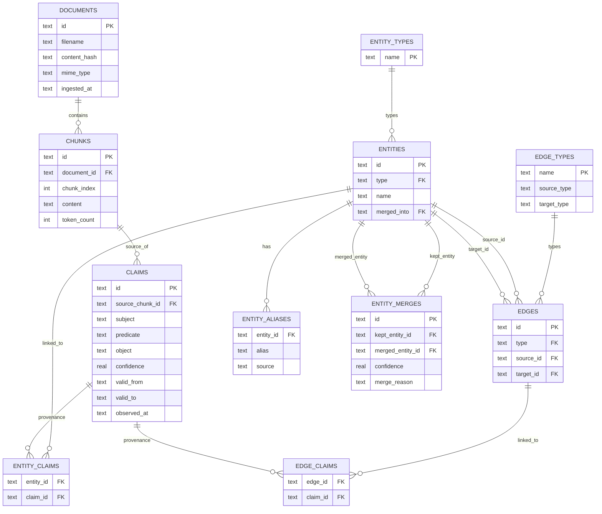
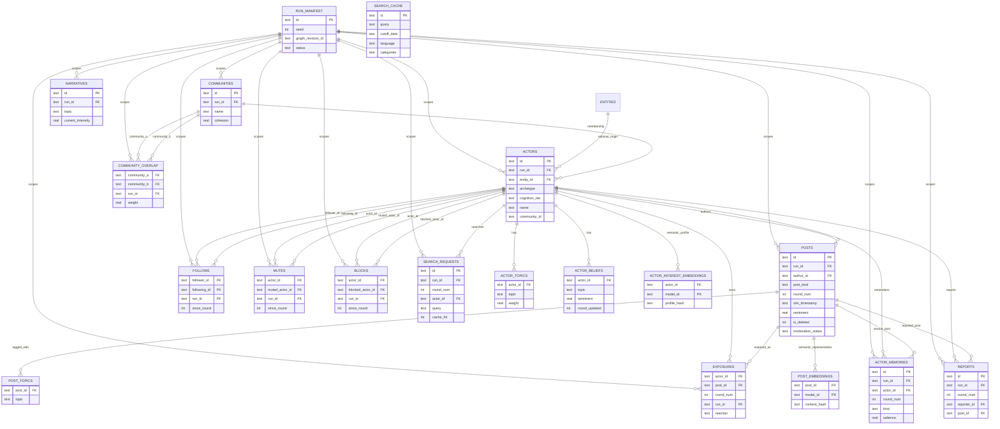
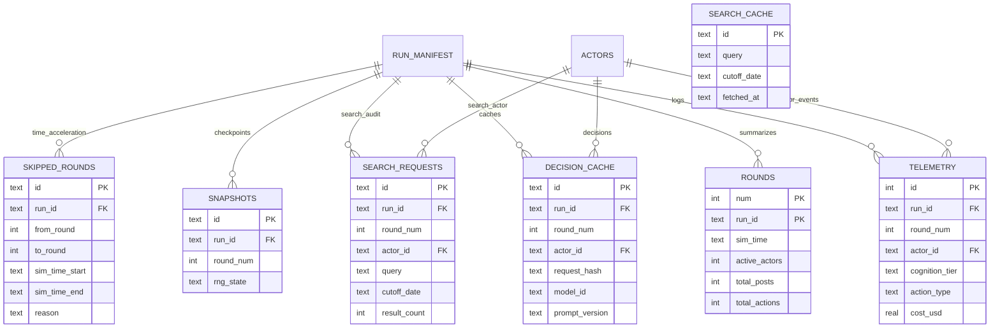

# SeldonClaw Data Model

This document is the human-readable map of the relational model implemented in [schema.ts](/Users/agc/Documents/seldonclaw/src/schema.ts) and accessed through [store.ts](/Users/agc/Documents/seldonclaw/src/store.ts). It is meant for:

- engineers implementing pipeline and runtime code
- operator tooling and CLI/shell work
- future frontend or API layers that need a stable mental model

The companion machine-readable file lives at [data-model.json](/Users/agc/Documents/seldonclaw/docs/data-model.json).

## Layers

SeldonClaw's relational model is organized in five layers:

1. **Provenance**
   Documents, chunks, and extracted claims.
2. **Knowledge Graph**
   Entity/edge ontology, instances, aliases, merges, and provenance links.
3. **Social Simulation**
   Actors, communities, follows, mutes, blocks, posts, reports, exposures, narratives, memories, and embedding caches.
4. **Observability**
   Telemetry, round summaries, skipped-round audit spans, and per-actor search audit logs.
5. **Reproducibility**
   Run manifests, decision cache, snapshots, and reusable web search cache.

## Layered ERD

### 1. Provenance + Graph

### 2. Run-scoped Social Simulation

### 3. Observability + Reproducibility

## Full ERD

```mermaid
erDiagram
  DOCUMENTS ||--o{ CHUNKS : contains
  CHUNKS ||--o{ CLAIMS : source_of
  ENTITY_TYPES ||--o{ ENTITIES : types
  EDGE_TYPES ||--o{ EDGES : types
  ENTITIES ||--o{ EDGES : source_id
  ENTITIES ||--o{ EDGES : target_id
  ENTITIES ||--o{ ENTITY_ALIASES : has
  ENTITIES ||--o{ ENTITY_MERGES : kept_entity
  ENTITIES ||--o{ ENTITY_MERGES : merged_entity
  ENTITIES ||--o{ ENTITY_CLAIMS : linked_to
  CLAIMS ||--o{ ENTITY_CLAIMS : provenance
  EDGES ||--o{ EDGE_CLAIMS : linked_to
  CLAIMS ||--o{ EDGE_CLAIMS : provenance

  RUN_MANIFEST ||--o{ ACTORS : scopes
  RUN_MANIFEST ||--o{ COMMUNITIES : scopes
  RUN_MANIFEST ||--o{ COMMUNITY_OVERLAP : scopes
  RUN_MANIFEST ||--o{ POSTS : scopes
  RUN_MANIFEST ||--o{ FOLLOWS : scopes
  RUN_MANIFEST ||--o{ EXPOSURES : scopes
  RUN_MANIFEST ||--o{ NARRATIVES : scopes
  RUN_MANIFEST ||--o{ ACTOR_MEMORIES : scopes
  RUN_MANIFEST ||--o{ TELEMETRY : scopes
  RUN_MANIFEST ||--o{ ROUNDS : scopes
  RUN_MANIFEST ||--o{ DECISION_CACHE : scopes
  RUN_MANIFEST ||--o{ SNAPSHOTS : scopes
  RUN_MANIFEST ||--o{ SEARCH_REQUESTS : scopes
  RUN_MANIFEST ||--o{ SKIPPED_ROUNDS : scopes

  ENTITIES ||--o{ ACTORS : optional_origin
  ACTORS ||--o{ ACTOR_TOPICS : has
  ACTORS ||--o{ ACTOR_BELIEFS : has
  ACTORS ||--o{ POSTS : authors
  ACTORS ||--o{ FOLLOWS : follower_id
  ACTORS ||--o{ FOLLOWS : following_id
  ACTORS ||--o{ EXPOSURES : sees
  ACTORS ||--o{ ACTOR_MEMORIES : remembers
  ACTORS ||--o{ ACTOR_INTEREST_EMBEDDINGS : semantic_profile
  ACTORS ||--o{ TELEMETRY : acts
  ACTORS ||--o{ DECISION_CACHE : decides
  ACTORS ||--o{ SEARCH_REQUESTS : searches

  POSTS ||--o{ POST_TOPICS : tagged_with
  POSTS ||--o{ EXPOSURES : reaches
  POSTS ||--o{ POST_EMBEDDINGS : semantic_representation
  POSTS ||--o{ ACTOR_MEMORIES : source_post

  COMMUNITIES ||--o{ ACTORS : membership
  COMMUNITIES ||--o{ COMMUNITY_OVERLAP : community_a
  COMMUNITIES ||--o{ COMMUNITY_OVERLAP : community_b
```

## Core invariants

- `documents`, `chunks`, `claims`, `entities`, and `edges` are the base knowledge corpus.
- `actors`, `posts`, `follows`, `exposures`, `narratives`, `actor_memories`, `telemetry`, `rounds`, `decision_cache`, `snapshots`, `search_requests`, and `skipped_rounds` are **run-scoped**.
- `mutes`, `blocks`, and `reports` are also **run-scoped** and participate directly in runtime visibility / moderation.
- `communities` and `community_overlap` are also **run-scoped** in the current implementation.
- `post_embeddings` and `actor_interest_embeddings` are per-post / per-actor caches keyed by model id.
- `search_cache` is reusable across runs and intentionally not foreign-keyed to a specific actor or round.
- `posts.post_kind` distinguishes `post`, `comment`, `repost`, and `quote`.
- `posts.is_deleted = 1` soft-deletes content without removing audit history.
- `posts.moderation_status = 'shadowed'` removes content from feed and propagation projections.
- `entities.merged_into IS NULL` means the entity is active and should appear in search/build steps.
- `exposure_summary` is a view over `exposures`, not a source-of-truth table.

## Runtime projections

These are not separate tables, but they are important to keep in mind when building the CLI or shell:

- `PlatformState`
  Read-only projection over `posts`, `post_topics`, `actors`, `communities`, `community_overlap`, `follows`, `mutes`, `blocks`, `exposures`, `post_embeddings`, and `actor_interest_embeddings`, plus derived interaction traces.
- `ActorContext`
  Read model assembled from `actors`, `actor_topics`, `actor_beliefs`, `posts`, `exposures`, and `actor_memories`.
- `NarrativeState`
  In-memory projection over `narratives`.
- `RoundContext`
  Runtime object created by the engine, not persisted directly.

## Recommended uses

- Use [data-model.md](/Users/agc/Documents/seldonclaw/docs/data-model.md) for human navigation and architecture reviews.
- Use [data-model.json](/Users/agc/Documents/seldonclaw/docs/data-model.json) for CLI/shell features that need schema-aware behavior:
  - intent routing
  - validation
  - schema introspection
  - safe query generation
